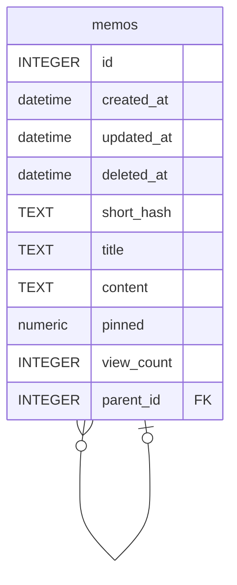

# memos

## Description

<details>
<summary><strong>Table Definition</strong></summary>

```sql
CREATE TABLE `memos` (`id` integer PRIMARY KEY AUTOINCREMENT,`created_at` datetime,`updated_at` datetime,`deleted_at` datetime,`short_hash` text,`title` text,`content` text,`pinned` numeric,`view_count` integer,`parent_id` integer,CONSTRAINT `fk_memos_children` FOREIGN KEY (`parent_id`) REFERENCES `memos`(`id`))
```

</details>

## Columns

| Name | Type | Default | Nullable | Children | Parents | Comment |
| ---- | ---- | ------- | -------- | -------- | ------- | ------- |
| id | INTEGER |  | true | [memos](memos.md) |  |  |
| created_at | datetime |  | true |  |  |  |
| updated_at | datetime |  | true |  |  |  |
| deleted_at | datetime |  | true |  |  |  |
| short_hash | TEXT |  | true |  |  |  |
| title | TEXT |  | true |  |  |  |
| content | TEXT |  | true |  |  |  |
| pinned | numeric |  | true |  |  |  |
| view_count | INTEGER |  | true |  |  |  |
| parent_id | INTEGER |  | true |  | [memos](memos.md) |  |

## Constraints

| Name | Type | Definition |
| ---- | ---- | ---------- |
| id | PRIMARY KEY | PRIMARY KEY (id) |
| - (Foreign key ID: 0) | FOREIGN KEY | FOREIGN KEY (parent_id) REFERENCES memos (id) ON UPDATE NO ACTION ON DELETE NO ACTION MATCH NONE |

## Indexes

| Name | Definition |
| ---- | ---------- |
| idx_memos_deleted_at | CREATE INDEX `idx_memos_deleted_at` ON `memos`(`deleted_at`) |

## Relations



---

> Generated by [tbls](https://github.com/k1LoW/tbls)
